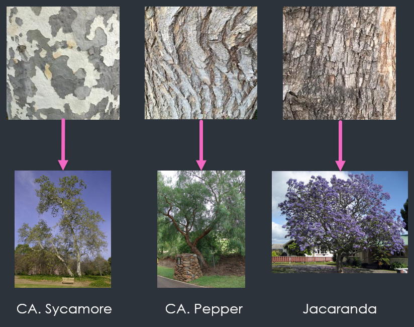
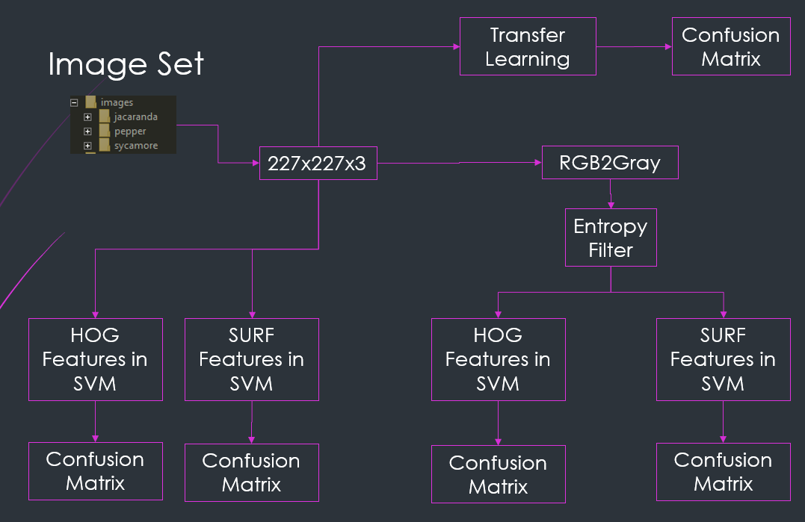
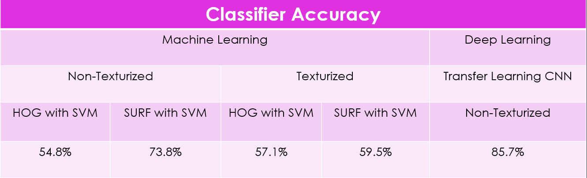

# Tree Classifier For 3 Species of Trees on CSUCI Campus

  

This was the final project for COMP546 Pattern Recognition where we were tasked to classify objects of interest. I decided attempting to differentiate between California Sycamore, California Pepper Tree, and Jacaranda would be a good project. I made it more interesting by only looking at bark when attempting classification. Traditionally leaves are used but bark presented a good problem to solve. 

  This project was coded in MATLAB, specifically as a Live Script for easier understanding of the output. If you don't own MATLAB, you can still see the Live Script and its output in <a href="TreeClassifier.pdf" target="_blank">**TreeClassifier.pdf**</a> which is annonated and breaks down the code in chunks.

  In all, 4 Multi-Class Support Vector Machines were trained, and 1 Deep CNN. The first two SVMs were trained on the original image set in the folder 'images', comparing classifier accuracy when HOG features were extracted and when SURF features were extracted. This process was replicated again but on a texturied image set in the folder 'imagesWithTexture'. These images were genereated by applying a local entropy filter over them to highlight and bring out any texture in the images. Lastly, I used AlexNet to perform Transfer Learning on the original image set, which produced the best accuracy, about 85%. Here is the flow I took with the code:

  

Here is a table summary of the accuracy achieved with the 5 classifiers:

  

## Getting Started
Clone the repository to your computer. 

### Prerequisites
  This code was tested on MATLAB 2019a and 2019b. You will need the Deep Learning, Statistics & Machine Learning, Computer Vision, and Image Processing toolboxes. You will also need to download AlexNet from the Add-Ons.

### Running the Code
  Open MATLAB and navigate to the cloned directory. Open the Live Script. I HIGHLY recommend you "Run Section" instead of hitting "Run". I purposely made it a Live Script to sectionize it so you can walk through the code and see the outputs as you go. If you just hit "Run" it will train the 5 classifiers and start ouputting figures all over the place. 

### Notes
- Training the CNN took me about 5 minutes but this can vary depending on your computer specs. The images are very small and there aren't a ton so even slow computers should handle the training fairly quickly. 
- All accuracy scores will be different for you when running the Live Script due to some randomness when sorting the images into training and validation sets. 
- I commented the code to the best of my ability, so refer to these comments in the Live Script if you have questions how things work
- There is a bug in MATLAB where the imtile() function has some memory management issues when called more than once. I commented the code where the bug happens so you're not confused by the output. 

### Keywords
Machine Learning, Transfer Learning, Pattern Recognition, Image Processing, Feature Extract, HOG Features, SURF Features, Multi-Class SVM, Image Datastore, Classifier, Image Classification, Bark

## Author
Ricky Medrano
